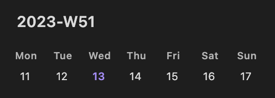
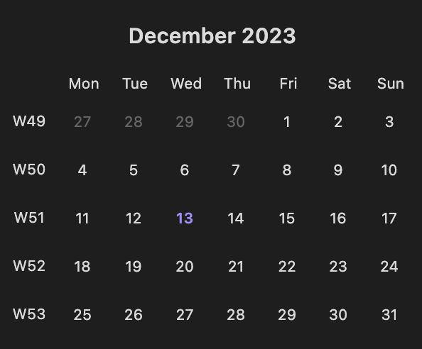

# Journals for Obsidian

Manage your journals in [Obsidian](https://obsidian.md/) knowledge base.

- Calendar based journals (daily, weekly, monthly, quarterly and yearly notes)
- Interval based journals (like finantial quarters or sprints)
- You can configure many different journals based on your needs
- Every note type configured separately (path to store, templates etc)
- Variables to insert journal related data into paths/note name/template content.
- Creating current journal notes on vault open
- Opening journal note on startup
- Code blocks for journal notes for easier navigation

## Installation

Follow the steps below to install Tasks.

1. Search for "Journals" in Obsidian's community plugins browser
2. Enable the plugin in your Obsidian settings (find "Journals" under "Community plugins").
3. Check the settings. Configure journals that you need.

## Compatibility with other plugins

- `Daily notes` core plugin - this plugin intends to be a replacement for it, the only difference now is the next/previous note command that will be added in next release. Notes created through Daily notes will not be connected to any journal (can be done manually editing frontmatter properties).
- `Periodic Notes` community plugin - this plugin was intially inspired by Periodic notes that seem to abandoned and aims to be a replacement for it.
- `Calendar` community plugin - there is no integration as for now and plun is to create a calendar view in this plugin making Calendar plugin not needed.
- `Templater` community plugin - it is planned to add support for Templater templates and plugin, and also some helpers

## Supported variables

There variables can be used in note name template, note storage path, content of template note.

- `{{journal_name}}` - name of journal note belongs to
- `{{note_name}}` - name of note
- `{{start_date}}` - first day of week, month, quarter, year or interval depending on note type, formatted using date format from settings, format can be overridden using following syntax `{{start_date:format}}` where format is string using Moment.js format rules (like `{{start_date:YYYY-MM-DD}}`)
- `{{end_date}}` - last day of week, month, quarter, year or interval depending on note type, formatting rules are the same as in `{{start_date}}`
- `{{date}}` - alias to `{{start_date}}`
- `{{index}}` - available for interval based journals indicating index of interval (like financial quarter or spring number)

## Supported code blocks

For easier navigation plugin provides code blocks that can be inserted into note content.

````markdown
```calendar-nav

```
````

Navigation code block helps navigating relative to current note.

Example look for daily note:


---

````markdown
```interval-nav

```
````

This block is similar to previous one just for interval based journals.

Example look for interval note (configured as 1 week sprints):


---

````markdown
```calendar-timeline

```
````

Timeline code blocks helps navigating daily notes in bigger periods (like week, month, quarter or year). By default daily and weekly notes show `week` timeline, monthly note - `month` timeline, quarter note - `quarter` timeline and yearly note - `calendar` timeline. This can be changed using `mode` param.

````markdown
```calendar-timeline
mode: month
```
````

Sample week timeline



Sample month timeline



Quarter and Calendar timeline repeat month timeline for every month in quarter or year.

## Contributing

Contributions via bug reports, bug fixes, documentation, and general improvements are always welcome. For more major feature work, make an issue about the feature idea / reach out to me so we can judge feasibility and how best to implement it.
